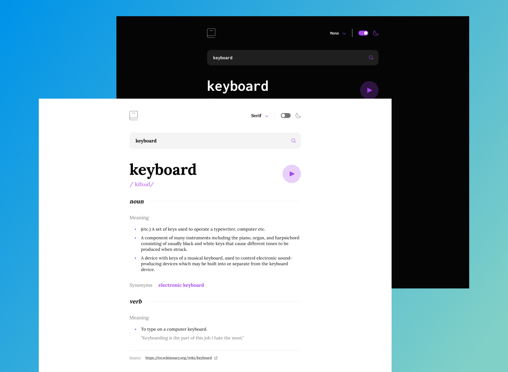

# Dictionary Web App




### Description
This is a fun project built with vuejs which uses the [Free Dictionary API](https://dictionaryapi.dev/) for showing your search results.
Some screenshots were attached to this file for preview, but you can also have a look at the:

#### [Live Demo](https://dictionary-web-app-by-towkir.netlify.app/)

### Features
This minimal app provides some cool features at present, where a user can:

- Search for words using the input field
- See the meaning, example, synonyms and phonetics for the searched word via Free Dictionary API's response
- See a form validation message when trying to submit a blank form
- Play the audio file for a word when it's available
- Switch between serif, sans serif, and monospace fonts
- Switch between light and dark themes
- View the optimal layout for the interface depending on their device's screen size
- See an eye soothing UI with interactive elements
- Have their system preferred theme (dark / light) already applies to this app
- Theme and font choice is preserved through localstorage.

#### About
Github Repo can be found [here](https://github.com/towkir/dictionary-web-app) (if you're not already viewing this from github)    


---

#### Here is the part that every vue project readme is filled with 

```
# Project setup
npm install

# Compiles and hot-reloads for development
npm run serve

# Compiles and minifies for production
npm run build

# Lints and fixes files
npm run lint
```

*Feel free to contribute, fix bugs, or provide feedback*
